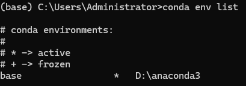
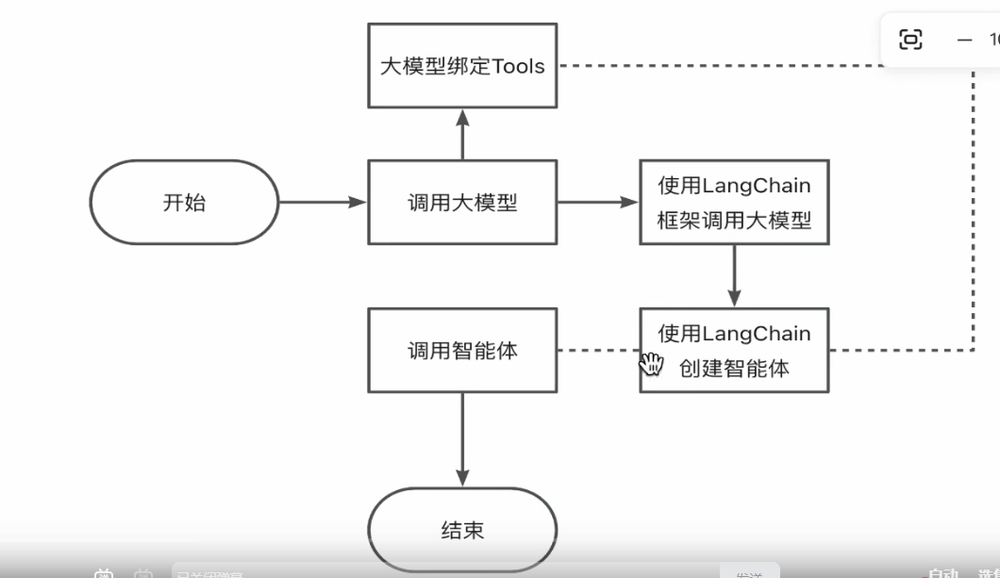

# conda 命令
conda env list

#安装uv工具
pip3 install uv

#create a new python project
uv init

#add a dependency to the project
uv add

#智能体的开发流程

#调用大模型的方法
#方法1：Ollama 本地调用
ollama --version
#安装ollama后，在终端执行命令: ollama serve，启动#ollama服务，注意：本地开代理，启用服务可能失败

ollama serve
#查看本地安装的大模型
ollama ls

#设置大模型的下载目录
set OLLAMA_MODELS=d:\ollama\models
#下载大模型
ollama pull 大模型的名称
#启动大模型 xxxx 
ollama run qwen3:4b
ollama run deepseek-r1:70b
#windows上安装ollama后在终端执行 ollama命令，报错不识别ollama,需要设置环境便利PATH。

在PyCharm 在终端中，执行uv add langchain-ollama

#方法2：阿里云百炼API调用