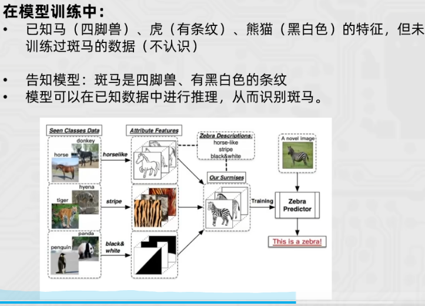
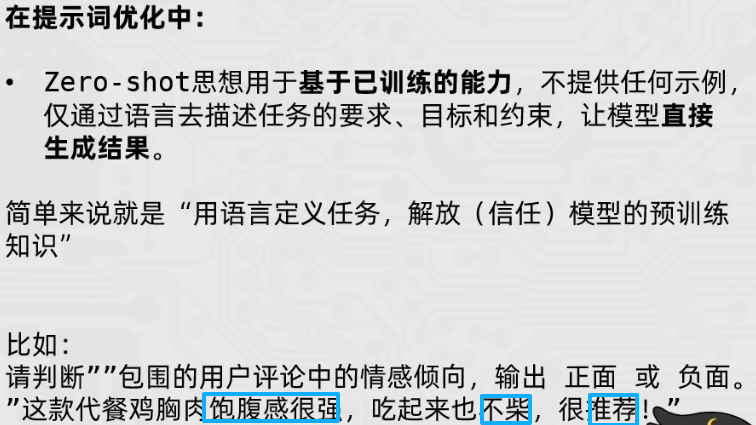
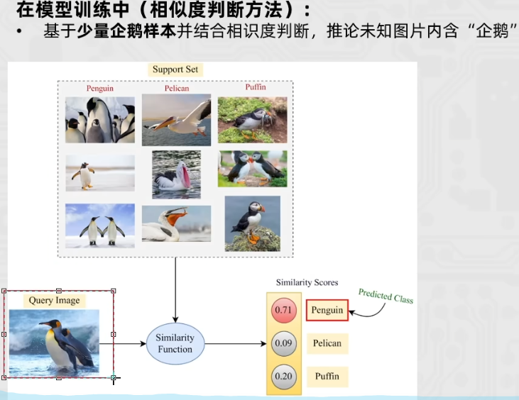
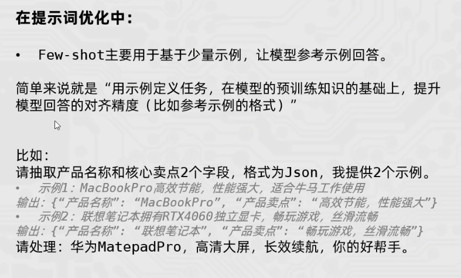
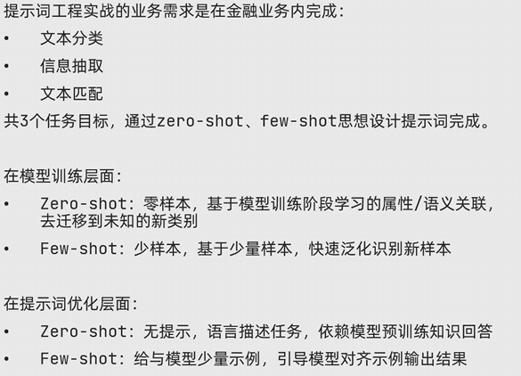

两种思想
1.Zero-shot 学习
这种能力被称为“零样本”学习，因为模型在训练时从未见过测试集中的新类别，在模型训练和提示词优化中均有体现。

2.Few-shot 学习
Few-shot学习(Few-shotLearning)是指少样本学习，当模型在学习了一定类别的大量数据后，对于新的类别，只需要少量的样本就能快速学习，对应的有one-shot learning，单样本学习，也算样本少到为一的情况下的一种few-shot learning。

