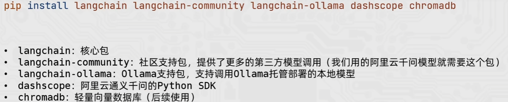
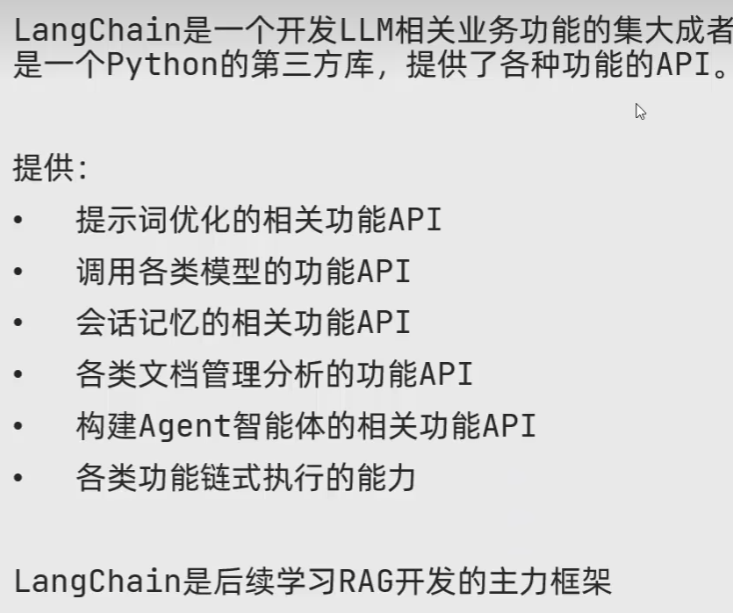

LangChain：围绕LLMS(大语研模型)建立的一个框架
pip install langchain langchain-community langchain-ollama dashscope chromadb -i https://pypi.tuna.tsinghua.edu.cn/simple

部署成功后，在命令行执行python
>>> import langchain
不报错则部署成功

